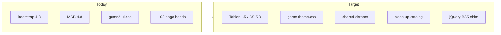
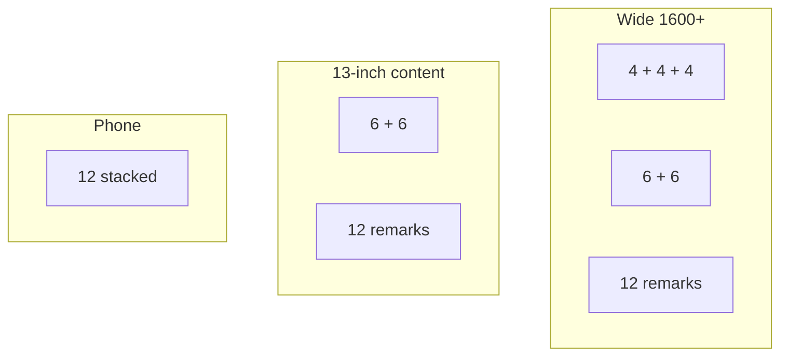
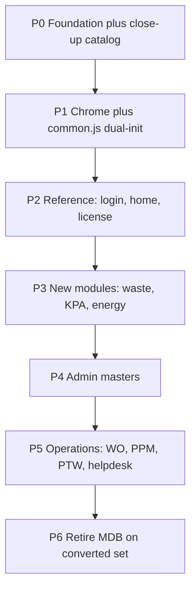

# Tabler-based GEMS UI revamp

GEMS web ([gfm-gems](/Applications/XAMPP/xamppfiles/htdocs/gfm-gems)) already has the right **colors**. The flaws are the **stack** and the **close-up craft**: Bootstrap 4.3 + MDBootstrap 4.8 + a 2,800-line override file, fighting Material widgets on ~102 duplicated page shells. The large layout was restyled; the details (labels, close buttons, selects, badges, table chrome) still look unfinished.

We will **not change** `#0055b8`, `#00ada8`, `#ceeff0`, `#243746`, or `#e7eaec`. We will change the **system those colors sit in**, rebuild the **small components**, and lock **one form arrangement** so filters and dialogs still fit a 13-inch laptop.

Corporate reference: [GFM Services](https://globalfm.com.my/) — white canvas, Lato headings, Poppins/Roboto body, simple header, professional spacing. GEMS stays an operations app (sidebar + tables + forms), not a marketing site.



## Why Tabler, and what we keep

**Use Tabler 1.5** (`@tabler/core`). It ships Bootstrap 5.3.8 inside one CSS/JS bundle, so we do **not** also load [css/bootstrap.min.css](/Applications/XAMPP/xamppfiles/htdocs/gfm-gems/css/bootstrap.min.css) or [css/mdb.min.css](/Applications/XAMPP/xamppfiles/htdocs/gfm-gems/css/mdb.min.css) on migrated pages. Tokens are CSS variables — GFM colors map in one file. Tabler’s default form/table/modal craft is already tighter than the current GEMS overlay.

**Keep:**
- jQuery + existing page JS (`mzAjaxRequest`, DataTables, Highcharts)
- Font Awesome Pro 6.5.1 (do not rewrite hundreds of `fas fa-*` to Tabler Icons)
- Current logo (`img/icon/logo.png`) and login background
- DataTables (switch the integration CSS/JS from Bootstrap 4 to Bootstrap 5)

**Do not load Tabler + MDB on the same page.** They conflict. Migration is dual-stack: old pages stay on MDB until converted.

**Force light theme.** Tabler 1.5 defaults to `auto` / OS dark mode. Set `data-bs-theme="light"` on `<html>` and do not load `tabler-theme.js`. Dark mode would be a color-theme change.

## GFM theme on Tabler

New file: [css/gems-theme.css](/Applications/XAMPP/xamppfiles/htdocs/gfm-gems/css/gems-theme.css) — tokens plus a **thin** component layer (only what Tabler does not already do well). Map existing GEMS variables onto Tabler:

```css
:root {
  --gems-primary: #0055b8;
  --gems-secondary: #00ada8;
  --gems-accent: #ceeff0;
  --gems-text: #243746;
  --tblr-primary: #0055b8;
  --tblr-primary-rgb: 0, 85, 184;
  --tblr-primary-fg: #fff;
  --tblr-font-sans-serif: "Poppins", "Lato", system-ui, sans-serif;
  --tblr-body-color: #243746;
  --tblr-body-bg: #f1f5f9;
  --tblr-link-color: #0055b8;
}
```

Page-level corporate rules (without recoloring):
- **Canvas:** flat page background, not the current body gradient
- **Type:** Lato for page titles, Poppins for UI
- **Chrome:** vertical Tabler navbar + thin top bar; drop 28px floating “pill” topbar/sidebar cards
- **Page headers:** title + subtitle + actions (Tabler `page-header`), not a full-width blue→teal banner on every module
- **Radius:** Tabler default (~8px), not 24–28px blobs
- **Teal** stays as accent (active nav, metric highlights), not a second primary everywhere
- **Status colors** stay semantic (green/amber/red)

[docs/DESIGN_SYSTEM_DOCS.md](/Applications/XAMPP/xamppfiles/htdocs/gfm-gems/docs/DESIGN_SYSTEM_DOCS.md) will be rewritten to this contract (it still documents an old indigo header).

## Close-up design contract (this is the missing piece)

The last restyle fixed the **page silhouette** and left the **zoom-in** work messy. Migrating to Tabler is not enough if we copy the same local hacks. Every converted page must pass this contract. Build it first as a living catalog page (P0), then use it as the QA checklist on P2+.

### What is currently wrong up close

These are real patterns in the codebase, not generic complaints:

- **Modal header/close misalignment.** Titles use `mt-2 ml-2` and close buttons use `pt-4` / Bootstrap `.close` + `&times;` on top of `.gems-modal-close` ([html/modal_license.html](/Applications/XAMPP/xamppfiles/htdocs/gfm-gems/html/modal_license.html), [html/modal_kpa_eval_new.html](/Applications/XAMPP/xamppfiles/htdocs/gfm-gems/html/modal_kpa_eval_new.html)). The X is not vertically centered with the title.
- **Two form languages in one dialog.** License still uses MDB `.md-form.md-outline` floating labels (need a JS `.active` class or the label sits on the value). Newer KPA/waste modals use visible labels. Users see both.
- **Native selects were hidden by MDB.** The app invented `.gems-plain-select` / `browser-default` + `display:block !important` to fight that. Heights, chevrons, and borders still do not match text inputs.
- **Wrong button color family.** Footers still use MDB `btn-info` / `btn-outline-info` (cyan) next to GEMS primary blue ([html/modal_kpa_eval_new.html](/Applications/XAMPP/xamppfiles/htdocs/gfm-gems/html/modal_kpa_eval_new.html)).
- **Five button systems.** `.btn`, `.btn-action`, `.btn-icon`, `.btn-header`, `.gems-icon-button` — different sizes, radii, and hover lifts (`translateY(-2px)` on table actions).
- **Heavy input chrome.** Filter fields use 2px primary-tinted borders plus drop shadows ([css/gems2-ui.css](/Applications/XAMPP/xamppfiles/htdocs/gfm-gems/css/gems2-ui.css) `.filter-card .form-control`). They look louder than the data.
- **Broken / leftover CSS.** `.gems-field span-2` is invalid (space, not a class). Comment `/* issue with workding */` at line 1528. Duplicate DataTables pagination rules.
- **Badge vocabulary split.** `.status-badge`, `.badge-soft-*`, `.badge-pill`, plus page-specific chips. Same status looks different on Home vs a module table.
- **Table card still a gradient bar.** `.home-table-card .table-header` is another blue→teal strip, so a page can have *two* gradient banners (page header + table header).
- **Icon-only actions with tooltip-only labels.** Fine visually if the hit target is 32–36px and `aria-label` exists; today many are tooltip-only and fail keyboard/screen readers.
- **Required / error markup is ad hoc.** `*`, `.waste-req`, `#txtXErr` paragraphs, `.gems-field-error` — different reds, different placement.
- **DataTables leftovers.** Length menu and column-visibility still go through MDB `.select-outline` (labels then hidden with `display:none`). Pagination is restyled twice.

### Component rules (must look correct at 100% zoom)

**Forms**
- Always a visible label above the control (`form-label`). No floating labels. No `.md-form`.
- One input height (Tabler `form-control` / `form-select`). Text, select, date, and textarea share border, radius, and focus ring.
- Required = label text + `*` in muted/danger, plus `aria-required`. One helper class only.
- Error = 12–13px text directly under the field, `#dc2626`, shown only when invalid. Do not reserve a permanent empty `<p id="…Err">` that shifts layout if we can use Tabler invalid state.
- Readonly/disabled = distinct gray fill, not “looks editable”.
- Checkboxes/radios = Tabler `form-check`, aligned to the first line of the label.

**Buttons**
- Three sizes only: `sm` (tables/filters), default (forms), `lg` (login primary).
- Three families only: `btn-primary` (GFM blue), `btn-outline-secondary` (cancel/close), `btn-ghost` / icon button (toolbar).
- Danger actions use `btn-outline-danger` or a confirm modal — not orange “edit” vs random `btn-info`.
- Table row actions: one 32px icon button style, no lift-on-hover, tooltip **and** `aria-label`. View/edit/delete color tints stay, but same geometry.
- Never mix `btn-info` / `btn-default` / pill-on-gradient on converted pages.

**Modals**
- Tabler `modal` + `modal-header` / `body` / `footer`. Flat white header, title 1.05–1.15rem, `btn-close` optically centered with the title (flex, no `mt-2`/`pt-4` hacks).
- No gradient modal header. Brand color is on the primary footer button, not a 26px-radius rainbow bar.
- Footer: Cancel (outline) left/right-end, primary action last. Same pair on every modal.
- Body scroll, not a clipped form; sticky footer. Labels never collide with inputs.

**Tables**
- One card: border + light shadow, **no** gradient table header. Title is plain text + optional icon.
- Header cells: 12px, semibold, muted, **not** forced uppercase + 0.08em tracking (that is the current “shouty” look).
- Body: `table-vcenter`, 13–14px, consistent cell padding, numeric columns tabular/right-aligned.
- Row hover = light gray, not a second shadow.
- Empty state inside the card (icon + one sentence + primary action), not a raw “No data available in table”.
- Pagination / length / search use Tabler form controls, one baseline.

**Badges and chips**
- One status component: Tabler `badge` + a GEMS map (`success`, `warning`, `danger`, `info`, `secondary`). Sentence case, not uppercase pills unless the status string is already an acronym.
- Counts and “showing X of Y” use muted text, not a second pill language.

**Focus, hover, density**
- Visible 2px focus ring using `rgba(0,85,184,.35)` on every control and icon button. Do not `outline: none` without a replacement (current `.gems-modal-close` does this).
- Hover = background shift only, no bouncing `translateY`.
- Default density: 8px radius. Gaps and control height follow the form-arrangement tokens below (compact on 13-inch, not a third ad-hoc size).

**Nav / notifications / toasts (chrome close-ups)**
- Sidebar items: one icon size, one indent for children, one active state (teal or blue tint — pick one and keep it).
- Notification dropdown: list rows with time + text, no `z-depth-1` Material cards per item.
- Toastr/alerts: Tabler `alert` or one toast style, GFM colors, readable close icon.

### Close-up QA (every converted page, in the browser)

A screenshot of the whole page is **not** done. For each migrated screen, check at **1366×768** (primary 13-inch), **1280×800**, and ~375px:

1. Modal open: title, close, first label, first input, footer buttons — aligned and one family. Header and footer stay visible; only the body scrolls.
2. Select vs text input: same height and border.
3. Validation: trigger an error; message sits under the field and does not overlap or shove the next row off-grid.
4. Table: header, first row actions, pagination, empty state.
5. Focus: Tab through header actions, filters, table buttons, modal. Ring always visible.
6. Hover: no jump, no color clash (`btn-info` cyan vs primary blue).
7. Form grid: no 1+3 leftover column, no control wrapping inside its cell, no horizontal page scroll.
8. Related pages that share the modal/section still match.

P0 catalog page must show good and bad-to-avoid examples of the above so later waves copy one source.

## Form arrangement (13-inch first)

Close-up rules fix a single field. This section fixes **how fields sit together**. A 13-inch laptop is the design target, not an afterthought. Typical site use is **1366×768** or **1280×800**. After a ~240px sidebar that leaves about **1000–1120px** of content width and **~700px** of height. Today the chrome already spends that budget badly: sidebar forced to `20rem` (320px) in [html/nav_left.html](/Applications/XAMPP/xamppfiles/htdocs/gfm-gems/html/nav_left.html), main `padding-top: 7.5rem`, and centered modals with `mt-3 pt-3 mb-5` plus `max-height: calc(100dvh - 235px)` ([css/style.css](/Applications/XAMPP/xamppfiles/htdocs/gfm-gems/css/style.css)) — on 768px height the footer is easy to lose.

### What is currently inconsistent

- **No shared field grid.** Filters use `auto-fit / minmax(220px)` ([css/gems2-ui.css](/Applications/XAMPP/xamppfiles/htdocs/gfm-gems/css/gems2-ui.css)). Waste uses `waste-grid-4` + `waste-field-span-2/3`. Modals mix `col-md-6` / `col-md-12` ([html/modal_license.html](/Applications/XAMPP/xamppfiles/htdocs/gfm-gems/html/modal_license.html), [html/modal_create_complaint.html](/Applications/XAMPP/xamppfiles/htdocs/gfm-gems/html/modal_create_complaint.html)). `auto-fit` on a 13-inch content pane often lands as 3+1 leftover or a stretched single field.
- **Uneven gaps.** 14px, 16px, 18px, 1.25rem, and Bootstrap `form-group` margins coexist. Empty reserved `#…Err` paragraphs add phantom vertical space.
- **Uneven control heights.** Waste filters force `min-height: 46px`; other inputs use MDB outline height; buttons in the same row do not match.
- **Modals ignore laptop height.** `modal-dialog-centered` + extra top/bottom margin + 960px `.gems-modal` width. A medium form should never need 960px or a vertically centered dialog on 768px screens.
- **Page forms vs modal forms are different languages.** [pages/waste_generation.html](/Applications/XAMPP/xamppfiles/htdocs/gfm-gems/pages/waste_generation.html) is closer to a good sheet; license/complaint still stack floating labels in uneven `col-md-*` rows.

### One layout system

Use **one CSS grid**, not a new framework. Tokens live in `gems-theme.css`:

```css
:root {
  --gems-control-h: 38px;      /* 13-inch / default app density */
  --gems-label-gap: 4px;
  --gems-field-gap: 12px;      /* row and column gap */
  --gems-section-gap: 20px;
  --gems-sidebar-w: 15rem;     /* 240px, not 20rem */
}
@media (min-width: 1600px) {
  :root {
    --gems-control-h: 40px;
    --gems-field-gap: 16px;
    --gems-section-gap: 24px;
  }
}
```

**Field shell** (every control, filter or modal):

```html
<div class="gems-field gems-field-6">
  <label class="form-label" for="optSite">Site <span class="required">*</span></label>
  <select id="optSite" class="form-select"></select>
</div>
```

**Spans** (12-column mental model, implemented as grid spans):

| Class | Use |
| --- | --- |
| `gems-field-3` | Short: date, month, year, qty, status, yes/no |
| `gems-field-4` | Short-medium: code, phone, 3-up on a wide modal |
| `gems-field-6` | Default: site, name, select, most pairs |
| `gems-field-8` | Wide but not full: type + search |
| `gems-field-12` | Remarks, description, file, address, textarea |

Rules:
- A row is a `.gems-form-grid` (`display: grid; grid-template-columns: repeat(12, 1fr); gap: var(--gems-field-gap)`).
- **13-inch content width (< 1200px):** max **2 columns** of `gems-field-6`. `gems-field-3/4` become half-width (6) so we never get four skinny fields. `gems-field-8` and `gems-field-12` go full width.
- **Wide (≥ 1600px):** 3-up allowed (`gems-field-4`). Never 4-up for text/selects.
- **Phone (< 576px):** every field `span 12`.
- Long text / remarks are always `gems-field-12`. Do not put them in a half column on a laptop.
- Helper text and errors sit **inside** the field cell so a 2-line error does not break the sibling field’s baseline. Prefer `min-height` on the error slot of 0 and let the row grow together.
- Section title, then grid, then `var(--gems-section-gap)` — no extra random `mt-4` / `mb-4_5`.



### Filters

Filters are the same grid, one card, compact:
- Site / search / status / date = `gems-field-6` on 13-inch, `gems-field-3` or `4` only when the content pane is wide.
- Action buttons (Apply, Reset, Export) sit in the last cell, **aligned to the control baseline** (not the label), same `--gems-control-h`.
- If a module has more than **4** filters on 13-inch, extra filters go behind a “More filters” collapse. Do not wrap a second ragged row of 220px tiles.
- DataTables built-in filter stays hidden (`dom: 'lrtip'`). Length + search share the table card toolbar, same control height.

### Page forms (sheets)

Waste-generation-style sheets use the same `gems-form-grid`, not `waste-grid-4`. A sticky or in-flow footer row: required-note left, Clear + primary right. On 13-inch the primary actions stay on one line; they stack only below 576px.

### Modals on a short laptop

- Widths only: `sm` 480, `md` 640, `lg` 800. Default create/edit = `md`. **No 960px** unless the dialog contains a table.
- Use `modal-dialog-scrollable`, **not** `modal-dialog-centered` for any form taller than ~5 fields.
- `max-height: calc(100dvh - 1.5rem)`. Header and footer sticky; body scrolls.
- Drop `mt-3 pt-3 mb-5` and the 235px magic number.
- Two-column body (`gems-field-6` + `gems-field-6`) is the laptop default. Full-width for remarks/file.

### Chrome that steals the form

- Sidebar **15rem** (240px), fold/overlay below 1400px so a 1280 laptop keeps ~1000px+ for the form.
- Page header compact on ≤1366: less padding, title + actions on one row if they fit, wrap actions rather than shrinking fields.
- Do not put a large metrics row *and* a four-filter card *and* a table above the fold if the filters wrap. Metrics can be a single compact strip on 13-inch.

### Catalog and QA must include arrangement

`pages/ui_catalog.html` gets three form demos at 1366×768:
1. Filter bar (4 fields + actions)
2. Create modal (`md`, 6+6+12, scrollable)
3. Page sheet (pairs + full remarks + footer)

Verify in the browser at 1366×768 and 1280×800 — that is the pass bar, not 1920×1080.

## Compatibility layer (required, or JS dies)

Bootstrap 5 / Tabler dropped jQuery plugins. The app has **100+** `$('#modal').modal('show')` calls and widespread `data-toggle` / `data-dismiss`.

Add [js/gems-bs5-jquery.js](/Applications/XAMPP/xamppfiles/htdocs/gfm-gems/js/gems-bs5-jquery.js) that wraps `tabler.Modal`, `Tooltip`, `Popover`, `Collapse`, `Tab`, `Dropdown` as `$.fn.modal` / `$.fn.tooltip` / etc. Also accept both `data-toggle` and `data-bs-toggle` during migration.

In [js/common.js](/Applications/XAMPP/xamppfiles/htdocs/gfm-gems/js/common.js):
- Detect Tabler chrome (`body.gems-tabler` or `#navbar-menu`)
- **Tabler path:** skip `$(".button-collapse").sideNav()`, `materialSelect()`, `$('.collapsible').collapsible()`, `pickadate`
- **MDB path:** keep current behavior for unmigrated pages
- `mzOption*` already skips `.gems-plain-select` — Tabler pages use native `form-select` and that skip path
- Rebuild `#ulNavLeft` HTML as Tabler `navbar-nav` + `data-bs-toggle="collapse"` instead of MDB `collapsible-header` / `waves-effect`

Date fields that still use `.datepicker` / pickadate move to native `<input type="date">` or one small lib (Litepicker) on converted pages only.

## Shared chrome and a real head include

Today every page copies 15+ `<link>`/`<script>` tags. That is why close-up styles drifted.

Add:
- [html/head_tabler.html](/Applications/XAMPP/xamppfiles/htdocs/gfm-gems/html/head_tabler.html) — FA Pro, Tabler CSS, DataTables BS5, `gems-theme.css`
- [html/nav_left_tabler.html](/Applications/XAMPP/xamppfiles/htdocs/gfm-gems/html/nav_left_tabler.html) + [html/nav_top_tabler.html](/Applications/XAMPP/xamppfiles/htdocs/gfm-gems/html/nav_top_tabler.html) — Tabler vertical sidebar (logo, `#ulNavLeft`, footer year) and topbar (page title, notifications, profile, sign out)
- Optional [html/scripts_tabler.html](/Applications/XAMPP/xamppfiles/htdocs/gfm-gems/html/scripts_tabler.html) — jQuery, Tabler JS, shim, `common.js`
- [pages/ui_catalog.html](/Applications/XAMPP/xamppfiles/htdocs/gfm-gems/pages/ui_catalog.html) — internal close-up catalog (not in customer nav)

Migrated pages use `body` class `gems-tabler` and Tabler’s `.page` / `.page-wrapper` / `.page-body` instead of `fixed-sn light-blue-skin`.

Unmigrated pages keep [html/nav_left.html](/Applications/XAMPP/xamppfiles/htdocs/gfm-gems/html/nav_left.html) / [html/nav_top.html](/Applications/XAMPP/xamppfiles/htdocs/gfm-gems/html/nav_top.html) until their wave.

## Page template (replaces the module-page recipe)

Converted modules follow Tabler primitives, GFM colors only:

1. `page-header` — title, one-line description, primary actions
2. Optional `row` of `card` metric tiles (no decorative overflow circles)
3. `card` filter bar using `gems-form-grid` (visible labels, laptop 2-up)
4. `card` + DataTable (`table table-vcenter table-hover`)
5. Tabler `modal` matching the close-up **and** 13-inch scrollable-layout contract

## Migration waves (do not convert 102 pages at once)



**P0 — Foundation + catalog**  
Vendor Tabler into `css/vendor/tabler/` and `js/vendor/tabler/` (local, same as current XAMPP pattern). Add `gems-theme.css` (including form-arrangement tokens), jQuery shim, and `pages/ui_catalog.html` with close-up states **and** the three form-arrangement demos at 1366×768. Lock both contracts here before touching production pages.

**P1 — Chrome**  
Tabler nav fragments + dual `initiatePages()`. Inspect sidebar icons, active state, notification rows, profile menu — not only the layout box.

**P2 — Reference pages (prove shell *and* details)**  
[pages/login.html](/Applications/XAMPP/xamppfiles/htdocs/gfm-gems/pages/login.html), [pages/home.html](/Applications/XAMPP/xamppfiles/htdocs/gfm-gems/pages/home.html), [pages/license.html](/Applications/XAMPP/xamppfiles/htdocs/gfm-gems/pages/license.html) + [html/modal_license.html](/Applications/XAMPP/xamppfiles/htdocs/gfm-gems/html/modal_license.html). Browser-verify at **1366×768** and 375px: close-up QA plus form grid, filter wrap, and modal header/footer still on screen.

**P3 — Newest modules first**  
Waste, KPA, Energy — already closest to `module-page`. Rewrite their modals to the same form/button/modal contract (they still mix `btn-info` and custom labels).

**P4 — Admin masters**  
Site, zone, user, asset*, checklist, contract, etc.

**P5 — Heavy operational pages**  
Work order, PPM, PTW, helpdesk, space, reports. Convert shared [html/section_*.html](/Applications/XAMPP/xamppfiles/htdocs/gfm-gems/html/) and [html/modal_*.html](/Applications/XAMPP/xamppfiles/htdocs/gfm-gems/html/) with the page that owns them. These have the worst close-up debt (floating labels, mixed actions).

**P6 — Retire**  
When a page family is done: remove MDB/Bootstrap 4 from its head. After all authenticated pages: stop shipping `mdb.min.css` / `light-blue-skin` for the main app. Leave `maintenance/` and print/PDF templates (`ptw_print`, `ptw_pdf_template`) out of this revamp.

Out of scope: Flutter [metadata-gfm](/Users/zaefrul/Development/GFM/metadata-gfm), MDB demo `templates/`, print layouts.

## Mechanical BS4 → BS5 checklist (per page)

- Head: Tabler + `gems-theme.css`; drop `bootstrap.min.css`, `mdb.min.css`, `style.css` once equivalents exist
- `data-toggle` / `data-target` / `data-dismiss` → `data-bs-*` (shim covers leftovers)
- `ml-*`/`mr-*`/`pl-*`/`pr-*` → `ms-*`/`me-*`/`ps-*`/`pe-*`
- `custom-select` / `mdb-select` → `form-select`
- `md-form md-outline` → `form-label` + `form-control`
- `.close` → `btn-close`, flex-aligned in the header
- `btn-info` / `btn-outline-info` → primary / outline-secondary
- DataTables: `dataTables.bootstrap5`
- FA: standardize on local Pro 6 (drop CDN v5.6.1)
- Run the close-up QA list before marking the page done

## What “fixed” looks like

Users still see GFM blue/teal and the GEMS logo. They stop seeing Material ripples, overlapping labels, crooked close buttons, cyan `btn-info` next to blue primary, shouty uppercase badges, and gradient-on-gradient chrome. A zoomed-in field and a 1366×768 filter/modal should both look like one system — even pairs, same gaps, footer still on screen — the same discipline as [globalfm.com.my](https://globalfm.com.my/), not a marketing layout.

Implementation starts at P0–P2 only (including the catalog). Later waves copy that catalog, not invent another local style.
